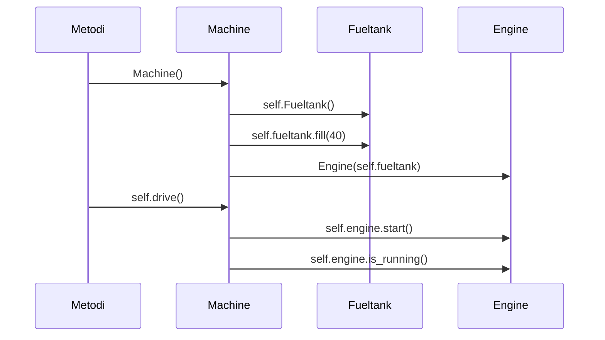

```mermaid
 sequenceDiagram
    participant Metodi
    participant Machine
    participant Fueltank
    participant Engine
    Metodi->>Machine: Machine()
    Machine->>Fueltank: self.Fueltank()
    Machine->>Fueltank: self.fueltank.fill(40)
    Machine->>Engine: Engine(self.fueltank)
    Metodi->>Machine: self.drive()
    Machine->>Engine: self.engine.start()
    Machine->>Engine: self.engine.is_running()
    
```
