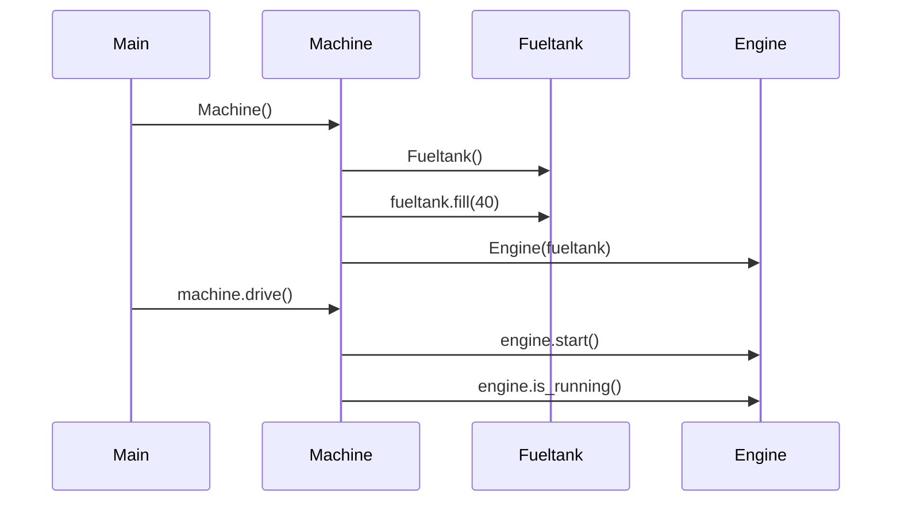

```mermaid
 sequenceDiagram
    participant Main
    participant Machine
    participant Fueltank
    participant Engine
    Main->>Machine: Machine()
    Machine->>Fueltank: Fueltank()
    Machine->>Fueltank: fueltank.fill(40)
    Machine->>Engine: Engine(fueltank)
    Main->>Machine: machine.drive()
    Machine->>Engine: engine.start()
    Machine->>Engine: engine.is_running()
    
```
