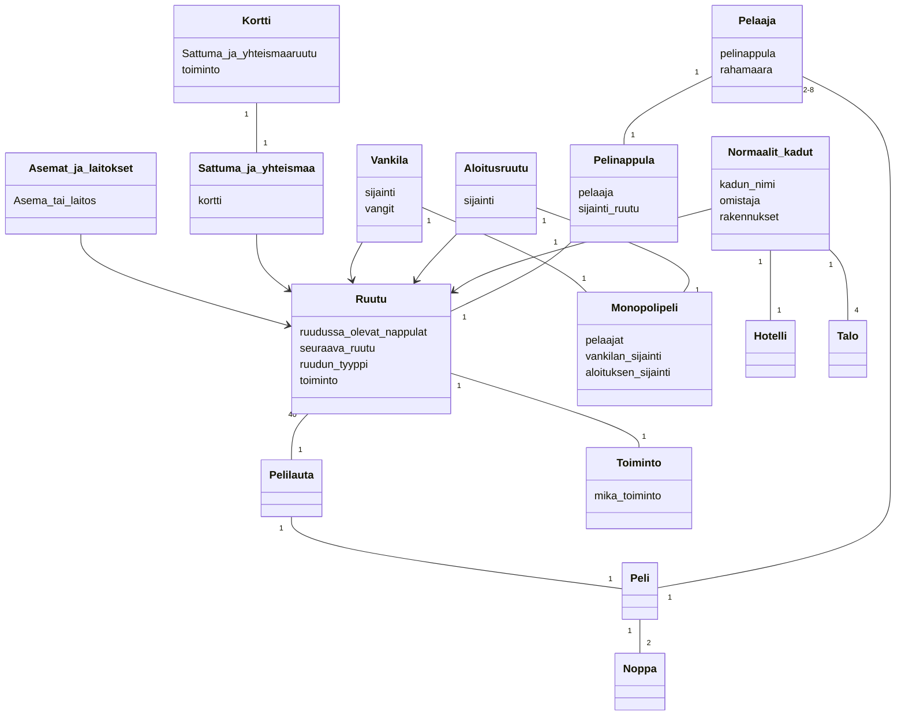

```mermaid
 classDiagram
	Pelaaja "2-8" -- "1" Peli
	Pelilauta "1" -- "1" Peli
	Ruutu "40" -- "1" Pelilauta
	Pelaaja "1" -- "1" Pelinappula
	Peli "1" -- "2" Noppa
	Pelinappula "1" -- "1" Ruutu
	Aloitusruutu "1" -- "1" Monopolipeli
	Vankila "1" -- "1" Monopolipeli
	Kortti "1" -- "1" Sattuma_ja_yhteismaa
	Normaalit_kadut "1" -- "1" Hotelli
	Normaalit_kadut "1" -- "4" Talo
	Ruutu "1" -- "1" Toiminto
	Normaalit_kadut --> Ruutu
	Aloitusruutu --> Ruutu
	Vankila --> Ruutu
	Sattuma_ja_yhteismaa --> Ruutu
	Asemat_ja_laitokset --> Ruutu
	
	class Monopolipeli{
	pelaajat
	vankilan_sijainti
	aloituksen_sijainti
	}
	class Pelaaja{
	pelinappula
	rahamaara
	}
	class Pelilauta{
	}
	class Ruutu{
	ruudussa_olevat_nappulat
	seuraava_ruutu
	ruudun_tyyppi
	toiminto
	}
	class Pelinappula{
	pelaaja
	sijainti_ruutu
	}
	class Noppa{
	}
	class Aloitusruutu{
	sijainti
	}
	class Vankila{
	sijainti
	vangit
	}
	class Sattuma_ja_yhteismaa{
	kortti
	}
	class Kortti{
	Sattuma_ja_yhteismaaruutu
	toiminto
	}
	class Asemat_ja_laitokset{
	Asema_tai_laitos
	}
	class Normaalit_kadut{
	kadun_nimi
	omistaja
	rakennukset
	}
	class Hotelli{
	}
	class Talo{
	}
	class Toiminto{
	mika_toiminto
	}
```
