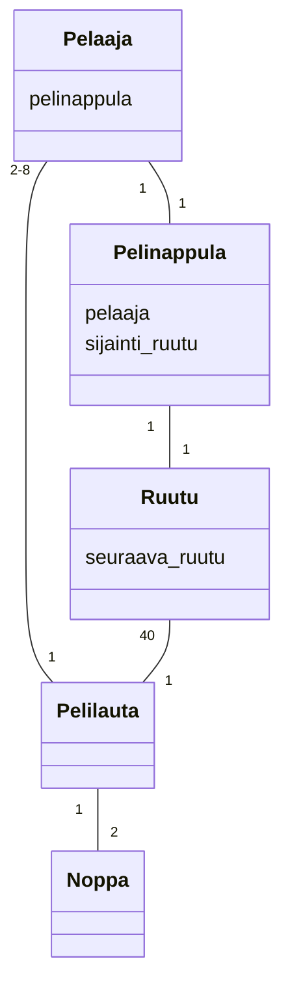

```mermaid
 classDiagram
	Pelaaja "2-8" -- "1" Pelilauta
	Ruutu "40" -- "1" Pelilauta
	Pelaaja "1" -- "1" Pelinappula
	Pelilauta "1" -- "2" Noppa
	Pelinappula "1" -- "1" Ruutu
	class Pelaaja{
	pelinappula
	}
	class Pelilauta{
	}
	class Ruutu{
	seuraava_ruutu
	}
	class Pelinappula{
	pelaaja
	sijainti_ruutu
	}
	class Noppa{
	}
```
