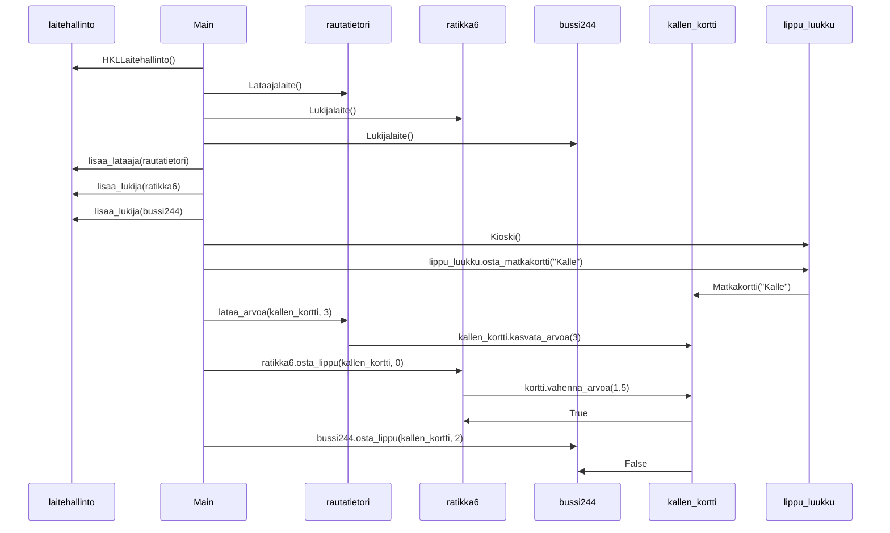

```mermaid
 sequenceDiagram
    participant laitehallinto
    participant Main
    participant rautatietori
    participant ratikka6
    participant bussi244   
    participant kallen_kortti
    participant lippu_luukku
    
    Main->>laitehallinto: HKLLaitehallinto()
    
    Main->>rautatietori: Lataajalaite()
    Main->>ratikka6: Lukijalaite()
    Main->>bussi244: Lukijalaite()
    
    Main->>laitehallinto: lisaa_lataaja(rautatietori)
    Main->>laitehallinto: lisaa_lukija(ratikka6)
    Main->>laitehallinto: lisaa_lukija(bussi244)
    
    Main->>lippu_luukku: Kioski()
    
    Main->>lippu_luukku: lippu_luukku.osta_matkakortti("Kalle")
    lippu_luukku->>kallen_kortti: Matkakortti("Kalle")
    
    Main->>rautatietori: lataa_arvoa(kallen_kortti, 3)
    rautatietori->>kallen_kortti: kallen_kortti.kasvata_arvoa(3)
    
    Main->>ratikka6: ratikka6.osta_lippu(kallen_kortti, 0)
    ratikka6->>kallen_kortti: kortti.vahenna_arvoa(1.5)
    kallen_kortti->> ratikka6: True
    
    Main->>bussi244: bussi244.osta_lippu(kallen_kortti, 2)
    kallen_kortti->> bussi244: False
```
