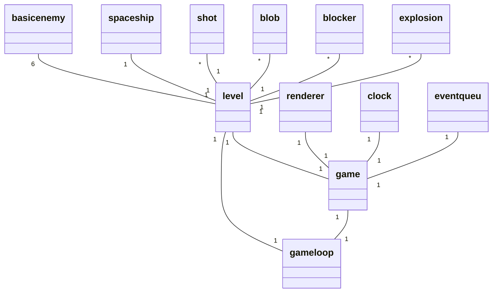

# Arkkitehtuurikuvaus

## Rakenne

Ohjelman perusrakenne koostuu luokista game, gameloop ja level. Testausta helpottamaan on tehty luokat clock, renderer ja event_queue, jotta kyseisiä toiminntallisuuksia ei olisi pakko upottaa muihin luokiin hankaloittamaan testaamista.
Pelin käynnistää luokka game ja pelisilmukkana toimii luokka gameloop. Gameloop vastaa pelaajan syötteen käsittelystä. Luokka level vastaa peliobjektien liikkuttelusta ja muusta yleisestä pelin tapahtumakulkuun liittyvästä toiminnasta. Levelin tarvitsemat objektit ovat sprites kansiossa. Jokaiselle erityyppisellä objektilla on omat luokkansa, jotka perivät pygamen sprite-luokan. Objektit hakevat oman kuvansa assets kansiosta.

## Luokkakaavio

