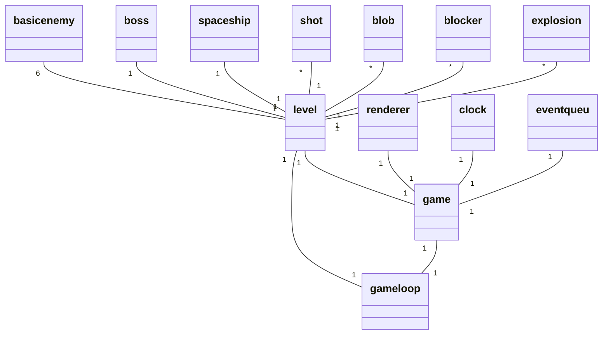
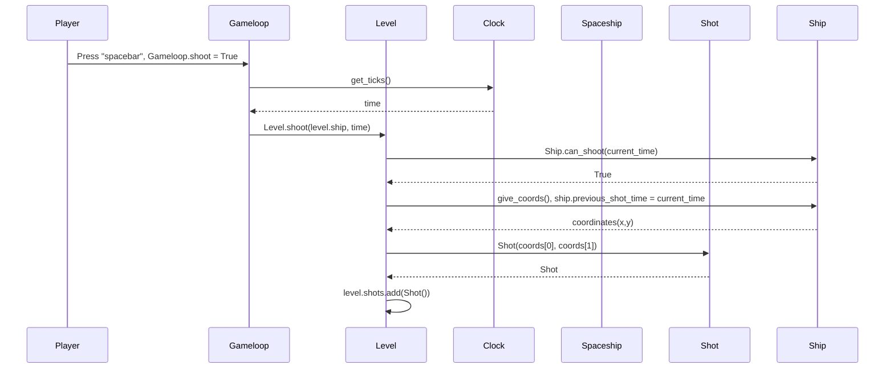

# Arkkitehtuurikuvaus

## Rakenne

Ohjelman perusrakenne koostuu luokista game, gameloop ja level. Testausta helpottamaan on tehty luokat clock, renderer ja event_queue, jotta kyseisiä toiminnallisuuksia ei olisi pakko upottaa muihin luokiin hankaloittamaan testaamista.
Pelin käynnistää ja alustaa luokka game ja pelisilmukkana toimii luokka gameloop. Gameloop vastaa pelaajan syötteen käsittelystä. Luokka level vastaa peliobjektien liikuttelusta ja muusta yleisestä pelin tapahtumakulkuun liittyvästä toiminnasta. Levelin tarvitsemat objektit ovat sprites kansiossa. Jokaiselle erityyppisellä objektilla on omat luokkansa, jotka perivät pygamen sprite-luokan. Objektit hakevat oman kuvansa assets-kansiosta.

## Luokkakaavio

Huomioita luokista:

Spritejä ovat basicenemy, spaceship, boss, shot, blob, blocker, explosion. 
Basicenemyjä luodaan kahta erilaista tyyppiä ja ne edustavat pelin vihollisia. Boss on haastavampi vihollinen, jolla on enemmän elämiä ja suurempi koko.
Spaceship luokka toimii pelaajan ohjaamana aluksena.
Pelaajan ammukset kuvataan luokalla shot ja vihollisten ammukset luokalla blob. Blocker luokka muodostaa alueen, jolle muut objektit eivät voi mennä, tällä hetkellä kentän reunat. 
Explosion on tällä hetkellä puhtaasti graafinen efekti. Explosion-luokka huolehtii myös blobien räjähdyksestä ja portaaliksi nimetyn efektin syntymisestä kun vihollisia syntyy lisää. 

## Sekvenssikaavio ammuksen syntymisestä, operaation onnistuessa ##

