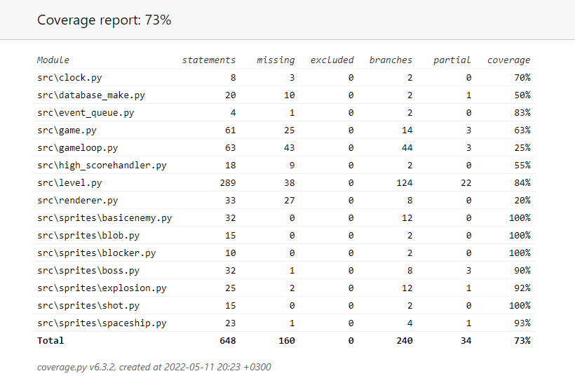

# Testausdokumentti

Ohjelmaa on testattu automatisoitujen yksikkö- ja intergaatiotestien avulla unittestillä. 
Myös manuaalisiä järjestelmätason testejä on suoritettu ohjelman halutunlaisen toiminnan varmistamiseksi.

## Yksikkö- ja integraatiotestaus

### Sovelluslogiikka

Luokan `level` toimintaa ja liki jokaista metodia testattiin sen varmistamiseksi, että pelin objektien toiminta on halutunlaista.
Luokan `gameloop` toimintaa testattiin stub-komponenttien avulla. Myös Luokan 'game' toimintaa testattiin jonkin verran.

### Sprite-luokat

Sprite-luokkien toimintaa testattiin levelin yhteydessä, sillä level vastaa spritejen käsittelystä.

### Testauskattavuus

Koko sovelluksen testauksen haaratumakattavuus on 73%.

### Asennus ja konfigurointi

Sovellus on haettu ja sitä on testattu Linux-ympäristössä [käyttöohjeen](https://github.com/arolaeemil/ot-harjoitustyo/blob/master/python-space-invaders/dokumentaatio/kayttoohje.md) antamin ohjein. Sovelluksen saattaminen toimintakuntoon ja
varsinainen pelaaminen todettiin onnistuvaksi. Peliä on testattu sekä Ubuntu for Windows-ympäristössä että "oikealla" Linuxilla.

### Toiminnallisuudet

[Vaatimusmäärittelyn](https://github.com/arolaeemil/ot-harjoitustyo/blob/master/python-space-invaders/dokumentaatio/vaatimusmaarittely.md) 
lupaamat toiminnallisuudet on käyty läpi testattessa.

### Sovelluksen mahdolliset ongelmat

Äänien toimivuutta kaikissa laitteistoissa ei kyetä takaaman. Tämän johdosta jätetty mahdollisuus ottaa äänet halutessaan käyttöön alkukyselyn kautta.
